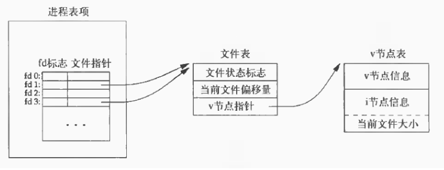

## 前言：
**前面笔者详细分析了网络编程中重要的通信技术：<font color = red>I/O复用技术</font>,接下来的几篇文章，我将重点来分析一下网络编程中另外一个重要的技术，即：<font color = blue>管道通信技术</font>。**
## dup、dup2函数基础
由于利用管道实现进程间通信，是通过创建2个文件描述符，但是初始化文件描述符都是随机的，或者说是从可用的文件描述符中去除，并与相对应的文件建立映射关系，如果我们想要将管道的两头与其他流相关，或者说重定向一个文件描述符，那么，我们就需要dup和dup2函数。

可以说，这两个函数的作用就是：<br>
***1.重定向文件描述符***
***2.复制文件描述符***
### dup函数：
```
#include<unistd.h>
int dup(int fd);//fd为文件描述符，失败返回-1
```
**dup函数创建一个新的文件描述符，该文件描述符和原有文件描述符指向相同的文件、管道或者网络链接，并且此fd总是系统当前可用的最小的文件描述符。**

### dup2函数：
```
#include<unistd.h>
int dup2(int fd1, int fd2);
//fd1是指需要重定向的文件描述符，fd2是定向到的文件描述符。失败返回-1
```
**dup2函数中fd2不做原本的工作，而改做fd1的工作，若此fd2文件描述符已经存在，则需要关闭他，再执行。**

<font size = 3 color = green>需要注意的是：这两个函数创建的文件描述符并不继承原有的文件描述符的属性(ex：close_on_exec,non-blocking等)，因为每个文件描述符都有一套文件描述符标志，新描述符执行时关闭(close_on_exec)标志总是由dup和dup2函数执行。只继承他的同一文件状态标志(读、写、添加等)。</font><br>
<br>其实对于文件描述符在内核中的存储有必要提一下：
* 每个进程在进程表中都有一个记录项，每个记录项中有一张打开文件描述符表，可将视为一个矢量，每个描述符占用一项。与每个文件描述符相关联的是：
   <br>(1) 文件描述符标志(close_on_exec,close_on_exec是一个进程所有文件描述符的标记位图，每个比特位代表一个打开的文件描述符，用于确定在系统调用execve()时需要关闭的文件句柄)。
   <br>(2) 指向一个文件表项的指针。
* 内核为所有打开文件维持一张文件表。每个文件表项包含：
   <br>(a) 文件状态标志(读、写、增写、同步、非阻塞等)。
   <br>(b) 当前文件位移量。
   <br>(c) 指向该文件v节点表项的指针。
* 节点表项。每个打开的文件都有一个v-node结构，v-node中包含了文件类型和对此文件进行各种操作函数的指针。对于大多数文件，V-node中还包含了文件inode节点信息，这些信息是打开文件时从磁盘上读入内存的，所以文件所有信息都是随时可用的。
<br> 1. v节点的信息
<br> 2. 当前文件的长度
<br> 3. i节点的信息
   <br>**也就是对应下图。
<br>**图解过程：**<br>
**假设执行了dup(1)函数，下一个可用的文件描述符是3。两个文件描述符指向同一文件表项。因此文件状态标志、当前文件位移量、指向文件的v节点表项指针共享。**<br>


## 函数的简单实例：
下面的例子便是运用dup函数或者dup2函数，将新建的文件描述符指向之前建立好的网络连接，因为关闭了标准输出，因此文件描述符1空闲下来，可以使用，即相当于将标准输出定向到了网络连接中，实现CGI服务器功能。

```
int main(int argc, char* argv[])
{
   if(argc <= 2)
    {
        printf("error\n");
        return 1;
    }
    const char* ip = argv[1];
    int port = atoi(argv[2]);

    struct sockaddr_in address;
    bzero(&address,sizeof(address));
    address.sin_family = AF_INET;
    inet_pton(AF_INET,ip,&address.sin_addr);
    address.sin_port = htons(port);

    int sock = socket(PF_INET,SOCK_STREAM,0);
    assert(sock >= 0);

    int ret = bind(sock,(struct sockaddr*)&address,sizeof(address));
    assert(ret != -1);

    ret = listen(sock,5);
    assert(ret != -1);

    struct sockaddr_in client;
    socklen_t client_addrlength = sizeof(client);
    int connfd = accept(sock,(struct sockaddr*)&client,&client_addrlength);
    if(connfd < 0)
    {
        printf("errno is %d\n",errno);
    }
    else
    {
        close(STDOUT_FILENO);
        dup(connfd);//自动寻找最小的文件描述符
        //dup2(connfd,1);//自己指定文件描述符，若已存在，则返回一个大于指定文件描述符的最小值
        printf("abcd\n");
        close(connfd);
    }
    close(sock);
    return 0;
}
```
利用telnet模拟客户端可以看出，的确本应该输出到标准输出的字符，送到了客户端，而没有打印到终端。实现了重定向功能。
