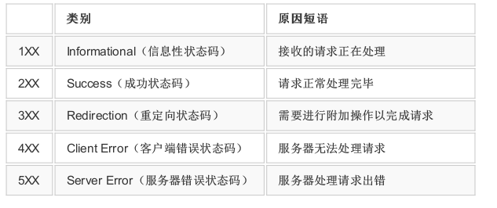

## 前言
***笔者最近看了<<图解HTTP>>这本书，了解了web开发人员需要了解的http协议的基础知识，并且在此整理一下重点的知识。***

## http的历史
http在1990年面世，但最开始并没有作为正式的标准建立。这时候的http，更多的被称为HTTP/0.9版本。<br>
之后在1996年的5月，http被正式作为标准公布，称为HTTP/1.0。<br>
之后在1997年的1月，公布了HTTP/1.1是目前主流的HTTP协议版本。<br>
目前HTTP/2.0正在制定中，但是仍然没有成为主流的版本。

##http请求和响应
### http请求
请求报文 = 请求方法 + 请求URI + 请求协议版本
          + 可选择的首部字段 + 内容实体
        = 报文首部 + 空行(CR+LF) + 报文主体<br>
请求行 = 请求方法 + 请求URI + 请求协议版本<br>
可选择的首部字段 = 请求首部 + 通用首部 + 实体首部 + 其他<br>
如图：<br>

ex:<br>
```
GET / HTTP/1.1     请求行
Host: hackr.jp     
User-Agent: Mozilla/5.0 (Windows NT 6.1; WOW64; rv:13.0) Gecko/20100101 Firefox/13.0
Accept: text/html,application/xhtml+xml,application/xml;q=0.9,*/*; q=0.8
Accept-Language: ja,en-us;q=0.7,en;q=0.3
Accept-Encoding: gzip, deflate
DNT: 1
Connection: keep-alive
If-Modified-Since: Fri, 31 Aug 2007 02:02:20 GMT
If-None-Match: "45bae1-16a-46d776ac"
Cache-Control: max-age=0
//空行(CR+LF)
```
### http响应
响应报文 = 协议版本 + 状态码 + 原因原语 + 可选择的首部字段 + 内容实体
= 报文首部 + 空行(CR+LF) + 报文主体
<br>状态行 = 协议版本 + 状态码 + 原因原语
<br>可选择的首部字段 = 响应首部字段 + 通用首部字段 + 实体首部字段 + 其他<br>
如图:<br>

ex:<br>
```
HTTP/1.1 200 OK    响应行
Date: Tue, 10 Jul 2012 06:50:15 GMT
Content-Length: 362
Content-Type: text/html
//空行
<html>        内容实体
......
```

### 首部字段
**首部字段包括通用首部字段、请求首部字段、响应首部字段、实体首部字段和其他。**<br>
1. 通用首部字段：General Header Fields
​ 请求报文和响应报文两方都会使用的首部。

2. 请求首部字段：Request Header Fields
​ 客户端发送请求报文给服务器时使用，补充了请求的附加内容，客户端信息，响应内容相关的优先级等信息

3. 响应首部字段：Response Header Fields
​ 服务器向客户端返回响应报文时使用的首部，补充响应的附加内容，也会要求客户端附加额外的内容信息。

4. 实体首部字段：Entity header Fields
​ 针对请求报文和响应报文的实体部分使用的首部。补充了资源内容更新时间等与实体有关的信息。

### http可使用的方法
1. GET方法：<br>
  用来请求访问被URI识别的资源。指定的资源经服务器解析处理后返回响应内容。
2. POST方法:<br>
  用来传输实体的主体，但其主要目的并不是获取响应的主体内容。
3. PUT方法：<br>
 用来传输文件，但HTTP/1.1的PUT方法本身不带验证机制，存在安全性问题，因此一般不使用。
4. HEAD方法：<br>
 用来查看URI指定的资源的有效性，仅返回响应头部，不返回实体主体。
5. DELETE方法：<br>
 用来删除请求URI指定的资源，与PUT方法相反，因此也一般不使用。
6. OPTIONS方法：<br>
 用来询问针对请求URI指定的资源支持的方法。
7. TRACE方法：<br>
 用来追踪路径，将客户端请求怎么发往服务器经过的路径反馈回去。
8. CONNECT方法：<br>
 此方法主要是与代理服务器通信时建立隧道，实现用隧道协议进行TCP通信。主要使用SSL和TLS协议将通信内容加密后传输到隧道。

### http状态码
状态码的类别：<br>

具体例子如下:<br>
* 200 OK 表示从客户端发来的请求在服务器端被正常处理了。
* 204 No Content 表示服务器接收成功受理，但是返回的响应报文中不含实体的主体部分。
* 206 Partial Content 表示客户端请求一定的范围内容，然后获取成功返回状态
* 301 Moved Permanently 表示永久性重定向，所请求的资源已经分配到了新的URI，以后资源都指向这个URI
* 302 Found 表示临时性重定向，希望用户本次使用新的URI，实际运用中允许POST方法改成GET方法。
* 303 See Other 也表示临时性重定向，但指定客户端采用GET方法。
* 304 Not Modified 该状态码表示发送附带条件时,不满足条件，则返回这个。
* 307 Temporary Redirect也表示临时的重定向，且不会从POST变为GET.
* 400 Bad Request 表示请求报文出错
* 401 Unauthorized 表示发送的请求需要有通过HTTP认证信息。
* 403 Forbidden 该状态码表示对请求资源的访问被服务器拒绝了。
* 404 Not Found 服务器上无法找到请求的资源。
* 500 Internal Server Error 表示服务器端在执行请求时发生了错误。
* 503 Service Unavailable 表示服务器暂时处于超负载或正在停机维护，现在无法处理请求。
