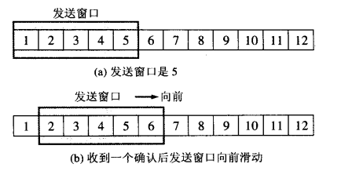

## 前言
***学习了计算机网络之后，发现很多基础知识其中的奥秘是经过前人一步步探索得来的，故而搜索了很多的资料，在这里用几篇博文进行总结。***
 **首先要说到的就是tcp可靠传输和流量控制的4种协议，这4种协议从无到有，从最初的单工停等协议(停止等待ARQ协议)到连续ARQ协议、选择重传ARQ协议，直到最终的滑动窗口协议，经过了一系列的演变过程。本博文就来浅析一下它们的区别和演变过程。**

## 单工停等协议
### 定义
***即发送方每次发送完一个分组(此处可能是tcp报文也可能是MAC帧)就停止发送，等待接收方的确认，只有在收到确认之后才能够再发送下一个分组。***

### 具体描述
***工作原理:***
1. 发送点对接收点发送数据包，然后等待接收点回复ACK并且开始计时。(利用超时计时器计时)
2. 在等待过程中，发送点停止发送新的数据包。
3. 当数据包没有成功被接收点接收时候，接收点不会发送ACK.这样发送点在等待一定时间后，重新发送数据包。
4. 反复以上步骤直到收到从接收点发送的ACK.

***原理图如下: ***

 如图1即在无差错的情况下，A发送，B接收，只有A收到B的确认时才可以发送下一个分组。  如图2即出现差错时利用的一种机制叫做超时重传机制，B没有收到A的报文，A也没收到来自B的确认报文，经过一个设定时间后，超时计时器到期，那么就要重传。 
 如图3即当A的发送分组没有差错和丢弃，但是B的确认分组出现差错，那么A收不到确认也就无法判断是确认出错还是发送分组出错,因此B需要丢弃当前接收的分组，等待超时计时器到期A重新发送，而后接收。 
 如图4即B的确认没有出错或者丢失，只是因为信道拥塞导致延时到达，因此A无法收到确认y而是需要重新发送之前的发送分组。

### 缺点
**这个协议的缺点是较长的等待时间导致低的数据传输速度。在低速传输时，对连接频道的利用率比较好，但是在高速传输时，频道的利用率会显著下降。**

## 连续ARQ协议
### 定义
***为了克服停止等待协议需要长时间等待的缺点，故而出现了连续ARQ协议，它是指发送方维护着一个窗口,这个窗口中不止一个分组,有好几个分组,窗口的大小是由接收方返回的win值决定的,所以窗口的大小是动态变化的,只要在窗口中的分组都可以被发送,这就使得TCP一次不是只发送一个分组了,从而大大提高了信道的利用率.并且它采用累积确认的方式,对于按序到达的最后一个分组发送确认。***

### 具体描述
**原理：**
  
 如图可知发送方维护一个5分组大小的窗口，只有收到接收方的一个确认后才将窗口向前挪动。
但是接收方由于**累计确认**方式,虽然一次性仍然只能接收一个确认分组，但是发送方不必等待接收方确认便可以再次发送。因此，接收方可以在收到几个分组之后，对**按序到达**的最后一个分组发送确认，这就表示到这个分组之前的所有分组都正确收到了。
** 重传机制：** 
采用回退N机制(Go-back-N)即GBN,表示凡是被发送出去尚未被确认的分组都放在发送方提供的较大的缓冲区内，若得到确认则取出。当接收方检测出失序的信息帧后，要求发送方重发最后一个正确接收的信息帧之后的所有未被确认的帧。其中利用超时计时器，若在规定时间内没有收到对应的应答帧，或者累计的应答帧，那么就说明出错了。

### 缺点
虽然连续ARQ的链路效率大大提升，但是相应的需要更大的缓冲空间，且接收方窗口大小总是1，浪费很多链路的带宽。

## 选择重传ARQ协议
### 定义
发送方据一个指定大小的窗口持续发送若干分组，即使发送过程中丢失分组，也会继续发送。和Go-back-N ARQ不一样，接收进程在出错后还是继续接收和确认帧。

### 具体描述
***基本原理： ***
如果一个发送的帧没有到达接收方，发送方继续发送后面的帧，直到它填满发送窗口 。接收方持续用接收的帧填充它的接收窗口，并且每次回复一个带有序列号的ACK帧。一旦发送窗口所有帧都发送了 ，发送方重新发送的帧号与ACK不对应的帧，然后继续。
 
 如图可知在2号分组出错时，继续发送其他的分组，接收方同时也接收其他的分组，但是并不提交给上层，只有等待重传的分组到达之后，再按序提交给高层。

**注意：** 接收方窗口大小与发送方要相同，并且最大的窗口值取最大序列号的一半。

### 缺点
1. 通信信道的利用率不高，也就是说，信道还远远没有被数据比特填满。
2. 是需要接收方发送ACK，这样增加了网络的负担也影响了传输速度。重复发送数据包来纠正错误的方法也严重的影响了它的传输速度。

## 滑动窗口协议
### 定义
滑动窗口协议实际是选择重传ARQ的特殊情况。

### 前提
1. TCP协议的两端分别为发送者A和接收者B，由于是全双工协议，因此A和B应该分别维护着一个独立的发送缓冲区和接收缓冲区，由于对等性（A发B收和B发A收)。
2. 发送窗口是发送缓存中的一部分，是可以被TCP协议发送的那部分，其实应用层需要发送的所有数据都被放进了发送者的发送缓冲区；
3. 发送窗口中相关的有四个概念：已发送并收到确认的数据（不再发送窗口和发送缓冲区之内）、已发送但未收到确认的数据（位于发送窗口之中）、允许发送但尚未发送的数据以及发送窗口外发送缓冲区内暂时不允许发送的数据；
4. 每次成功发送数据之后，发送窗口就会在发送缓冲区中按顺序移动，将新的数据包含到窗口中准备发送；

### 具体实现
**原理图： **
 
 分析图中可以看出：
1. 初始时发送窗口前沿是0，后沿也是0，因为前沿是指下一发送的序号，而后沿是指下一应答序号。
2. 而初始时接收窗口前沿是1，后沿是0，因为前沿和后沿之间的部分是指下一期望接收的序号。
3. 发送方前沿是发送完一个分组后就移动，后沿是收到接收确认分组之后才移动。
4. 接收方的前后沿同时移动，当接收到一个分组之后就向后移动。

## 4种协议的比较
|      | 单工停等 | 连续ARQ | 选择重传ARQ  | 滑动窗口 |
|------|:-------:|:-----:|:----:|:-------:|
| 应答帧是否需要编号 | 否 | 是 | 是 | 是 |
| 分组是否按序 | 是 | 是 | 是 | 是 |
| 发送窗口大小 | 1 | >1 | >1,最大值为最大确认序列号的一半| 同选择重传ARQ |
| 接收窗口大小 | 1 | 1 | >1,同发送窗口 | 同选择重传ARQ|

### 参考资料：
http://blog.csdn.net/guoweimelon/article/details/50879588
http://blog.csdn.net/wbw1985/article/details/4879224
http://pmghong.blog.51cto.com/3221425/1242470
 