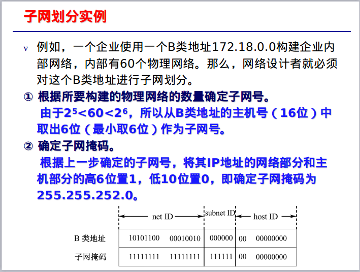
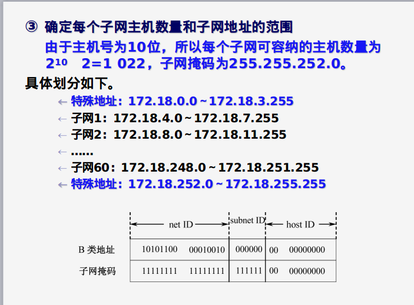

## 前言
***笔者上一篇分享了[tcp层可靠传输和流量控制的4种协议](http://zy943453722.ink/tcp%E5%8F%AF%E9%9D%A0%E4%BC%A0%E8%BE%93%E5%92%8C%E6%B5%81%E9%87%8F%E6%8E%A7%E5%88%B6%E7%9A%844%E7%A7%8D%E5%8D%8F%E8%AE%AE%E7%9A%84%E6%BC%94%E5%8F%98%E5%8F%B2/)，这次来分享一下ip层的重要知识，也就是划分子网和构造超网。***

## 前提
**在讲述划分子网和构造超网之前，让我们先来回忆一下ip地址的划分。**<br>
```
ip地址::={<网络号>,<主机号>}
```
**ip地址的划分以下几个特点：**
1. ip地址划分为A类、B类、C类、D类、E类5种
2. A、B、C类地址都是常用的单播地址，而D类是多播地址，E类地址保留为以后用
3. ip地址都是32位的二进制代码，为提高可读性，IP地址每8位插入一个点，叫做点分十进制表示法
4. 一般的，A类地址第一位二进制是0，B类地址前两位是10，C类地址前三位是110，D类地址前4位是1110，E类地址前4位地址是1111
5. A类地址前8位为网络号，7位可用，但7位全0（0.x.x.x)是个保留地址，表示本网络，7位全1(127.x.x.x)也是个保留地址，作为本地回环测试。因此可以指派2^7-2地址最为网络地址。
6. A类地址的主机号24位，但是全0(x.0.0.0)为网络地址即网关(网段)地址，全1(x.255.255.255)为该网段内的所有的主机
7. B类地址前16位为网络号，14为可用，但是14位中全1(128.0.0.0)不指派,因此B类地址可以指派网络数为2^14-1
8. B类地址主机号16位，全0，全1不指派，因此主机数为2^16-2
9. c类地址前24位为网络号，21位可用，但是21位全0(192.0.0.x)不指派，因此C类地址可以指派网络数为2^21-1
10. C类地址主机号8位，全0，全1不指派，因此主机数为2^8-2

***特殊的不使用的ip地址***<br>


## 划分子网
### 背景
由于ip地址空间利用率低，ip地址不够用等原因，急需要一种措施解决，因此出现了划分子网。
### 概念
一个拥有许多物理网络的单位，可将所属的物理网络划分为若干个子网，因此这个子网地址并不是真是网络通信中用到的外部地址，而是一个内部地址，因此这个单位对外仍表现为一个地址，即网关地址。
```
ip地址 ::= {<网络号>,<子网号>,<主机号>}
即从主机号拿出一部分作为子网号。
```
### 实现
要想在路由转发时找到相应的子网，需要用到子网掩码。子网掩码是一个网络或一个子网的重要属性。
？
<br>解答：<br>
将十进制转化成二进制，逐位相与。<br>
ip十进制：141   .    14    .   72     .    24<br>
ip二进制：10001101.    00001110  .  01001000.   00011000<br>
子网掩码：11111111.    11111111  .      
11000000.   00000000<br>
因此相与可得
网络地址二进制：10001101. 00001110. 01000000. 00000000<br>
网络地址十进制：141.14.64.0
<br>**求主机号：**<br>
1. 首先观察子网掩码与默认子网掩码的区别，比如此题，这是B类的ip，子网掩码默认应为255.255.0.0，而实际为255.255.192.0，即拿出了一部分主机号作为子网号。
2. 从子网掩码二进制可以看出第三节前2位与默认子网掩码不同，那么也就是拿出了2位主机号作为子网号，子网号2位，主机号14位。
3. 由ip地址可以看出主机号为001000.00011000，再化成10进制。
### 子网规划
**例题**<br>



## 构造超网(无分类编址CIDR)
### 背景
***划分子网缓解了一定的困难，但是ipv4地址眼看就要耗尽，人们研究出了无分类域间路由选择CIDR。***
### 概念
CIDR使ip地址从三级编址再次变为二级编址，但是无分类的二级编址，不分A.B.C类。记法为：<br>
```
IP地址 ::={<网络前缀>，<主机号>}
a.b.c.d/x  x为地址中网络部分的位数，32-x为主机位数。
```
此外，CIDR还采用斜线/记法,然后写上网络前缀所占的位数。

## 应用
由CIDR的某个IP地址可以看出子网掩码。
<br>ex:128.14.35.7/20<br>
隐含的指出子网掩码中有20个1，由观察可知此地址是B类地址，默认子网掩码为255.255.0.0，32-20=12位主机号，则4位主机号，因此子网掩码为255.255.240.0<br><br>
使用CIDR地址块后，网络路由器中的路由表项可以表示很多个传统IP地址的路由信息，相当于把若干个网络合并为一个超网来进行路由，这种地址的聚合称为路由聚合，也称为构造超网.