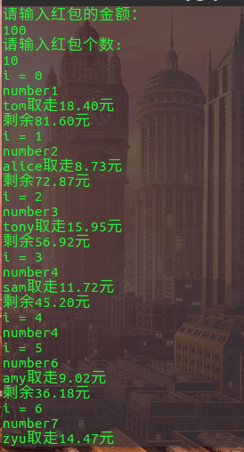
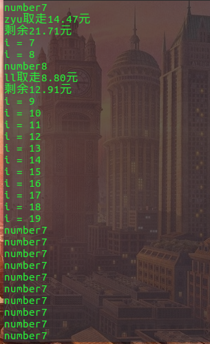

## 多线程并发
   众所周知，多线程编程很容易遇上诸如丢失更新、脏读、死锁等烦人的线程冲突问题。多线程的问题一旦发生便很难定位和解决，所以要在编程的初始阶段就要注意避免多线程程序常见的错误。
   
   微信红包程序应用线程基础API，采用多线程并发的方式进行抢红包操作。
   
   多线程并发指的是在同一个进程中执行多个线程。有操作系统相关知识的应该知道，线程是轻量级的进程，每个线程可以独立的运行不同的指令序列，但是线程不独立的拥有资源，依赖于创建它的进程而存在。也就是说，同一进程中的多个线程共享相同的地址空间，可以访问进程中的大部分数据，指针和引用可以在线程间进行传递。这样，同一进程内的多个线程能够很方便的进行数据共享以及通信，也就比进程更适用于并发操作。由于缺少操作系统提供的保护机制，在多线程共享数据及通信时，就需要程序员做更多的工作以保证对共享数据段的操作是以预想的操作顺序进行的，并且要极力的避免死锁(deadlock)。
   ## 微信红包程序
   
   **思路：**

1. 创建抢红包人员的结构体，分别给定名字，所抢金额，以及是否已抢过字段。
2. 创建生产者线程，用于产生红包，红包金额和红包数目从标注输入读入，并对生产者回调函数进行加锁操作。
3. 创建多个消费者线程，用于多人抢红包操作，其中消费者回调函数进行红包的随机分配算法，并进行加锁操作。

***下面是部分代码示例：***

```
 /*结构体部分*/
  typedef struct person
  {
      int id;
      char name[20];
      int flag;
       int money;
   }Person;

/* 生产者回调函数*/
   void *producer(void* value)//生产者只负责产生红包金  额和红包个数
   {
      double n = *(double*)value;
       pthread_mutex_lock(&lock);
       money = n;
       pthread_mutex_unlock(&lock);
       pthread_exit(NULL);
    }

/*消费者回调函数*/
  void *consumer(void *n)//消费者用于随机获取红包个数
  {
      int nn = *(int*)n;
      pthread_mutex_lock(&lock);
      printf("number%d\n",nn);
      if(money > 0 && per[nn].flag == 0)//还没抢过
      {
         if(num > 1)
         {
            srand((unsigned)time(NULL));//初始化随机数种子       
            double avg = money / num;//获取平均值
            double t = avg*2;
            double randmoney = (rand()%(int)(t*100) + (int)MIN*100)/100.00 + MIN;//初始化随机数
            money-=randmoney;
            printf("%s取走%.2lf元\n",per[nn].name,randmoney);
            printf("剩余%.2lf元\n",money);
            per[nn].id = nn;
            per[nn].money = randmoney;
            per[nn].flag = 1;
            num--;
           }
           else
           {
               printf("%s取走%.2lf元\n",per[nn].name,money);
               printf("剩余0元\n");
               money = 0;
               per[nn].id = nn;
               per[nn].money = money;
               per[nn].flag = 1;
               num--;
            }
         }
       pthread_mutex_unlock(&lock);
       pthread_cancel(pthread_self());
   }

/*主函数中主要线程API使用部分*/

    pthread_t th_a,th_b[Total];
     pthread_mutex_init(&lock,0);
     pthread_create(&th_a,NULL,producer,(void*)&value);
     pthread_join(th_a,NULL);
     int args[Total];
     for(i = 0; i < Total;i++)
     { 
         args[i] = i;
         if(per[i].flag == 0)
         {
             pthread_create(&th_b[i],NULL,consumer,(void*)&args[i]);
             // usleep(100);
             printf("i = %d\n",i);
         }
      }
     for(i = 0; i < Total; i++)
     {
         pthread_join(th_b[i],NULL);
     }
     pthread_mutex_destroy(&lock);

/* 全局变量声明*/
     #define Total 20//线程个数
     Person per[Total];
     double money = 0.0;//初始金额
     int num = 0;//初始红包个数
     pthread_mutex_t lock;//创建锁
```
***这是笔者在经过对线程的更深入理解后写好的版本。***

在最初的版本中，代码的**69行**的最后一个参数传的是(void*)&i,但程序运行后时而成功时而失败，失败时如下图：





***由运行结果可以看出20个线程全部都已创建出，但是却出现了红包抢不完的情况，而且观察发现，抢红包的顺序是乱序，且出现了同一个number的线程抢了好几次红包。***

### 因此总结为以下几个问题被给出解答：
** 1. 为什么创建线程是for循环控制，而抢红包是乱序？**

***答：***
   <font color = red>
   这是因为存在资源抢占现象，创建线程的顺序是有for循环控制的，但创建好线程之后，谁先调用回调函数顺序是不定的，谁的抢到cpu资源，谁就先进入回调函数，谁就先抢红包。
   </font>
   
** 2. 为什么看似是同一个线程抢了多次红包？**

***答：***
<font color = blue>
这是因为i++操作是三条指令，分别是找到i将其放入寄存器，而后+1，最后回赋。而在运行结果中出现多次number7的情况却并不是同一个线程抢红包多次。**因为可能有某几个线程在执行回调函数时，i的值还没有进行回赋操作，就被剥夺了cpu，而pthread_create函数最后一个参数原本传的是i的地址，即从地址中取i的值，但此时i还是原来的值。** 因此看似是同一个线程抢了多次红包，实则不同线程执行同一个i的回调函数。
</font>

** 3. 为什么经过修改用数组存i值可以，但最初版本用i时不可以？**

***答：***
<font color = green>
这是因为pthread_create函数最后一个参数存的是地址。

当存的是i的地址时，即i变一次，地址中的内容变一次，当创建出线程而不是立即调用回调函数，而是被剥夺cpu资源时，i值就随for循环变化而变化，因此当回调函数有了cpu资源后，i的地址中存的就不是当时地址中的内容了。

当用数组存i值时，数组共有Total个地址，创建线程时，当对应的i存到对应的地址，某个数组下表元素的地址只存其当时的值，因此即使不立即调用回调函数，之后拿到的也是当时参数地址中的值，这个值未发生变化。
</font>

** 4. 为什么67行有flag控制，而同一个i还能进去呢？**

***答：***
<font color = yellow>
**这个if判断由外部for循环控制，for循环是满足条件后进入，结束一次循环后i++，因此每次进入if后的i值都不同，至于说number7打印好多次，好像线程也创建了多次是错误的，是回调函数导致此原因，同问题2，在此就不赘述。
</font>

** 5. 为什么在for循环中加上sleep类的函数就可以正确抢红包，但是是顺序抢？**

***答：***
<font color = cyan>
这是因为usleep函数和sleep函数的作用是挂起当前线程，即挂起当前运行的主线程。在线程创建之后，即挂起主线程，只能进入子线程调用回调函数，回调函数又加了互斥锁，因此直到解锁才能释放cpu资源，即抢红包过程是顺序的。
</font>

**6.为什么在number8后会出现number7？（即为什么8号线程后才出现7号线程？**

***答：***
这其实还是存在资源抢占问题，7线程创建后，没进入回调函数就被其他线程剥夺了cpu，因此当轮到其执行回调函数时，已经过去了很久。


