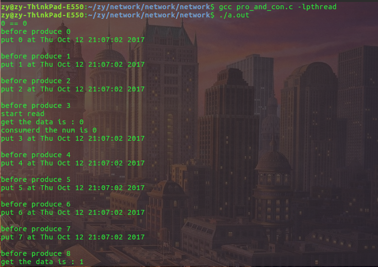
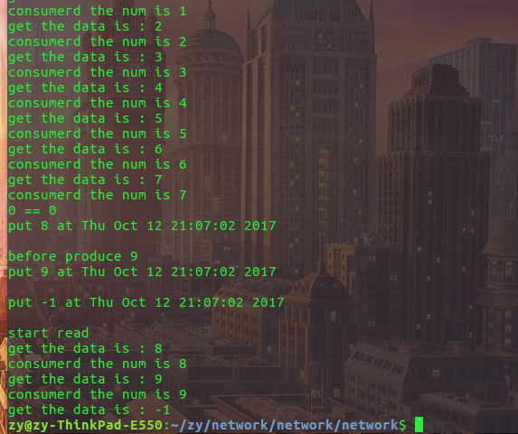

## 线程同步
**Pthread是POSIX threads 的简称，是POSIX的线程标准。**
 Pthread线程同步指多个线程协调地，有序地同步使用共享资源。多线程共享进程资源，一个线程访问共享资源需要一段完整的时间才能完成其读写操作，如果在这段时间被其他线程打断，就会产生诸多不可预知的错误。
 ## 互斥锁
 ### 1.互斥量：
    
  互斥量是一种线程同步对象，“互斥”的含义是同一时刻只能有一个线程获得互斥量。一个互斥量对应一个共享资源，互斥量状态：***1.解锁状态意味着共享资源可用，2.加锁状态意味着共享资源不可用。***
       
  一个线程需要使用共享资源时，使用thread_mutex_lock申请：1.当互斥量为解锁状态，则占用互斥量，并给互斥量加锁，占用资源（互斥量为加锁状态，其他线程不能使用互斥量并等待互斥量变为解锁状态），2.如果互斥量为加锁状态，则线程等待，直到互斥量为解锁状态（其他线程使用完共享资源后会解锁互斥量，释放资源）。
### 2.临界区：
临界区指的是一个访问共用资源的程序片断。通常由定义一个互斥量并加锁来保护这段临界区代码。
### 3.互斥量的相关函数：
***首先定义互斥量的结构体pthread_mutex_t。***

**1). 互斥量初始化函数：**
```
#include <pthread.h>
int pthread_mutex_init(pthread_mutex_t *mutex,const pthread_mutexattr_t *mutexattr)
```
第一个参数即互斥量结构体的指针，第二个变量则是互斥量的属性（当为NULL时是默认属性）。成功返回0，失败返回错误码。

**2). 互斥量上锁函数：**
```
#include<pthread.h>
int pthread_mutex_lock(pthread_mutex_t *mutex)
```
此函数参数即互斥量结构体，返回成功为0，失败返回错误码。
是阻塞的上锁函数。

**3). 互斥量解锁函数：**
```
#include<pthread.h>
int pthread_mutex_unlock(pthread_mutex_t *mutex)
```
参数和返回值同上锁函数。

**4). 互斥量的另一种上锁函数**
```
#include<pthread.h>
int pthread_mutex_trylock(pthread_mutex_t *mutex)
```
这是上锁函数的非阻塞版本。若已经上锁，返回EBUSY。

**5). 互斥量的销毁函数**
```
#include<pthread.h>
int pthread_mutex_destroy(pthread_mutex_t *mutex)
```
参数和返回值同上锁函数。
## 条件变量
### 1.概念
条件变量通过允许线程阻塞和等待另一个线程发送信号的方法弥补了互斥锁的不足，它常和互斥锁一起使用。使用时，条件变量被用来阻塞一个线程，当条件不满足时，线程往往解开相应的互斥锁并等待条件发生变化。一旦其它的某个线程改变了条件变量，它将通知相应的条件变量唤醒一个或多个正被此条件变量阻塞的线程。这些线程将重新锁定互斥锁并重新测试条件是否满足。
### 2.条件变量的相关函数
***首先定义条件变量结构体pthread_cond_t***

**1). 条件变量初始化函数**
```
#include<pthread.h>
int pthread_cond_init(pthread_cond_t *cond,pthread_condattr_t *cond_attr)
```
第一个参数即条件变量结构体指针，第二个变量即条件变量的属性（如果为NULL，则是默认属性）。成功返回0，失败返回错误码。

**2).条件变量的销毁函数**
```
#include<pthread.h>
int pthread_cond_destroy(pthread_cond_t *cond)
```
第一个参数即条件变量结构体指针。返回值同初始化函数。

**3). 条件变量的广播函数**
```
#include<pthread.h>
int pthread_cond_broadcast(pthread_cond_t *cond)
```
参数和返回值同销毁函数。
此函数以广播的方式唤醒所有等待目标条件变量的线程。

**4). 条件变量的信号函数**
```
#include<pthread.h>
int pthread_cond_signal(pthread_cond_t *cond)
```
参数返回值同销毁函数
此函数用于唤醒一个等待目标变量的线程。至于哪个线程被唤醒，则取决于线程的优先级和调度策略。

**5). 条件变量的等待函数**
```
#include<pthread.h>
int pthread_cond_wait(pthread_cond_t *cond)
```
参数和返回值同销毁函数。
**在调用此函数之前必须保证互斥量已经加锁。**

<font color = blue> **重点：模拟等待函数（pthread_cond_wait)调用前后的过程**</font>

第一个线程首先调用：
    pthread_mutex_lock(&mymutex);
 
然后，它检查了列表。没有找到感兴趣的东西，于是它调用：
    pthread_cond_wait(&mycond, &mymutex);

然后，pthread_cond_wait() 调用在返回前执行许多操作：
    pthread_mutex_unlock(&mymutex);
 
它对 mymutex 解锁，然后进入睡眠状态，等待 mycond 以接收 POSIX 线程“信号”。一旦接收到“信号”（加引号是因为我们并不是在讨论传统的 UNIX 信号，而是来自 pthread_cond_signal() 或 pthread_cond_broadcast() 调用的信号），它就会苏醒。但 pthread_cond_wait() 没有立即返回——它还要做一件事：重新锁定 mutex：
    pthread_mutex_lock(&mymutex);
 
pthread_cond_wait() 知道我们在查找 mymutex “背后”的变化，因此它继续操作，为我们锁定互斥对象，然后才返回。
### 3.代码示例（互斥锁和条件变量一起用实现线程同步）

* **程序思路：**
在这里利用多线程技术实现生产者和消费者问题，生产者线程向一缓冲区中写数据，消费
  者线程从缓冲区中读取数据，由于生产者线程和消费者线程共享同一缓冲区，为了正确读
  写数据，在使用缓冲队列时必须保持互斥。生产者线程和消费者线程必须满足：生产者写
  入缓冲区的数目不能超过缓冲区容量，消费者读取的数目不能超过生产者写入的数目。
  在程序中使用了一个小技巧来判断缓冲区是空还是满。在初始化时读指针和写指针为0;
  如果读指针等于写指针,则缓冲区是空的;如果(写指针+ 1) % N 等于读指针,则缓冲区是满的,
  %表示取余数,这时实际上有一个单元空出未用。下面是完整的程序段和注释。
  
```
#include<stdio.h>
#include<pthread.h> 
#include<time.h>
#include<stdlib.h>
#include<pthread.h>
#include<unistd.h>
#define BUFFER_SIZE 8 
#define OVER (-1)
#if 0

//互斥量和条件变量综合的结构体
struct prodcons {
    int buffer[BUFFER_SIZE]; 
    pthread_mutex_t lock;      //互斥LOCK
    int readpos , writepos;    //定义写和读的位置
    pthread_cond_t notempty;   //缓冲区非空条件判断
    pthread_cond_t notfull;    //缓冲区未满条件判断
};

//获取时间的函数
char * get_time(void){
    time_t rawtime;
    struct tm * timeinfo;
    time(&rawtime);
    return asctime(localtime(&rawtime));
}

//对结构体初始化函数
void init(struct prodcons * b){
    pthread_mutex_init(&b->lock,NULL);
    pthread_cond_init(&b->notempty,NULL);
    pthread_cond_init(&b->notfull,NULL);

    b->readpos=0;
    b->writepos=0;
}

//放数据的函数
void put(struct prodcons* b,int data){
    pthread_mutex_lock(&b->lock);
    if((b->writepos + 1) % BUFFER_SIZE == b->readpos)//这是缓冲区满了的情况，留一个空用于发送-1这个信号
    {
        pthread_cond_wait(&b->notfull, &b->lock);
    }
//    pthread_mutex_lock(&b->lock);
//    大家仔细理解互斥锁的位置，以及pthread_cond_wait函数的内核实现（解锁，休眠让出cpu，条件满足后被内核唤醒，上锁，形成临界区，保护资源）
    b->buffer[b->writepos]=data;
    b->writepos++;
    if(b->writepos >= BUFFER_SIZE)
        b->writepos=0;
    printf("put %d at %s \n", data, get_time());
    pthread_mutex_unlock(&b->lock);
    pthread_cond_signal(&b->notempty);
}

//取数据的函数
int get(struct prodcons *b){
    int data;

    pthread_mutex_lock(&b->lock);
    if(b->writepos == b->readpos)
    {
        printf("0 == 0\n");
        pthread_cond_wait(&b->notempty, &b->lock);
        printf("start read \n");
    }
    
    data = b->buffer[b->readpos];
    b->readpos++;
    if(b->readpos >= BUFFER_SIZE)
        b->readpos=0;
    printf("get the data is : %d\n", data);
    pthread_cond_signal(&b->notfull);
    pthread_mutex_unlock(&b->lock);
    return data;
}

//定义全局结构体对象
struct prodcons buffer;

//生产者回调函数
void *producer(void *data)
{
    int n;
    
    for(n = 0; n < 10; n++)
    {
        printf("before produce %d \n", n) ;
        put(&buffer, n);
    }
    
    put(&buffer, OVER);//发信号说-1已经放进去了，说明没内容写了
    
    return NULL;
}

//消费者回调函数
void *consumer(void * data)
{
    int d;
    while(1)
    {
        d = get(&buffer);
        if(d == OVER)//说明生产者已经写完
            break;
        printf("consumerd the num is %d\n", d);
    }
    return NULL;
}

//主函数
int main(void)
{
    pthread_t th_a, th_b;
    pthread_attr_t attr;
    void *retval;
    pthread_attr_init(&attr);
    init(&buffer);
    pthread_attr_setdetachstate(&attr, PTHREAD_CREATE_DETACHED);
//    pthread_create(&th_b, &attr, consumer, 0);
    pthread_create(&th_b, NULL, consumer, 0);
    sleep(3);
    pthread_create(&th_a, NULL, producer, 0);
    pthread_join(th_a, &retval);
    pthread_join(th_b, &retval);
    sleep(100);
    
    return 0;
}
```
  
  
  由图中可以看出，当条件变量不空不满足条件时，调用了等待函数使得此线程睡眠，让出cpu，进行其他操作，但是当条件满足时并不是直接回到原线程进行到的地方，而是重新加锁，在读。

参考资料：

http://blog.csdn.net/shanshanpt/article/details/
http://blog.csdn.net/lovecodeless/article/details/24885127
http://blog.sina.com.cn/s/blog_590be5290100ikh5.html