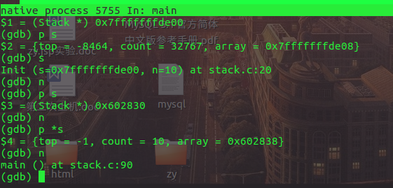
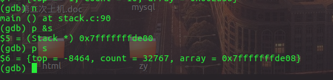
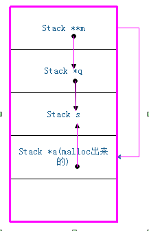
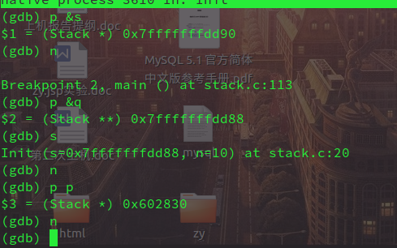
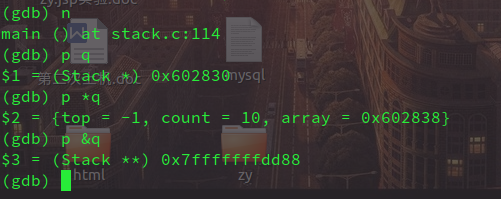

***这是一个关于结构体通过malloc初始化的悲伤的故事***
### 背景
因为本身结构体是不需要malloc就可以直接创建其对象，但是，当结构体中出现柔性数组或者是数组指针时，情况就截然不同了。因为这些数组都是要动态分配内存的，因此结构体也需要malloc。
### 问题描述：
但是此时问题就出现了，本身创建结构体对象时会在栈区分配一块地址，但是malloc之后又有另外一块地址指向了此对象，这是该怎么办呢？

### 代码实例：
```
/*这仅仅是个用数组动态创建栈的初始化过程*/
#include<stdlib.h>
#include<stdio.h>
typedef struct stack
{
      int top;
      int count;
      int array[];//柔性数组，也可以方括号内定义为0，也可以定义为数组指针
}Stack;
void Init(Stack *s,int n)
{
    s = (Stack*)malloc(sizeof(Stack) + n * sizeof(int));
   s->top = -1;
   s->count = n;
}
void Destroy(Stack **s)
{
      free(*s);
      *s = NULL;
}
int main()
{
   Stack s;
   Stack *q = &s;
   Init(q);
   Destroy(&q);
   return 0;
}
```
### gdb调试显示结果：


***由图中可以看出原本传入Init函数的stack*的地址为0x7fffffffde00，但malloc出来的新地址为0x602830,改变malloc出来地址上的内容，函数返回时自然而然没有保存下来。
再次打印s的地址，<font color = blue>果然还是原地址，相应数据也没有保存下来</font>**
### 解决方案：
思路: 

   既然一级指针会在init函数中被重新malloc，之后返回后保存不下来，那么可以启用2级指针，之后，让malloc出来的指针和原指针的地址相同(即2级指针也指向malloc出来的指针)这样返回时才能真正将malloc出来的指针保存下来。 
具体解决方法 
重写init方法:
```
void Init(Stack **s,int n)
{
  Stack *p = (Stack *)malloc(sizeof(Stack) + n * sizeof(int));//新malloc出一块地址指向原来的结构体
  *s = p; //将新malloc出来的地址赋值给原地址，让两个变成同一地址
  p->top = -1;
  p->count = n;
}
```
### 图解：


**此时再次调用gdb调试：<br>**


可以看出当从init函数返回后q指针已经变为malloc出来的地址，由此数据也被保存了下来。
